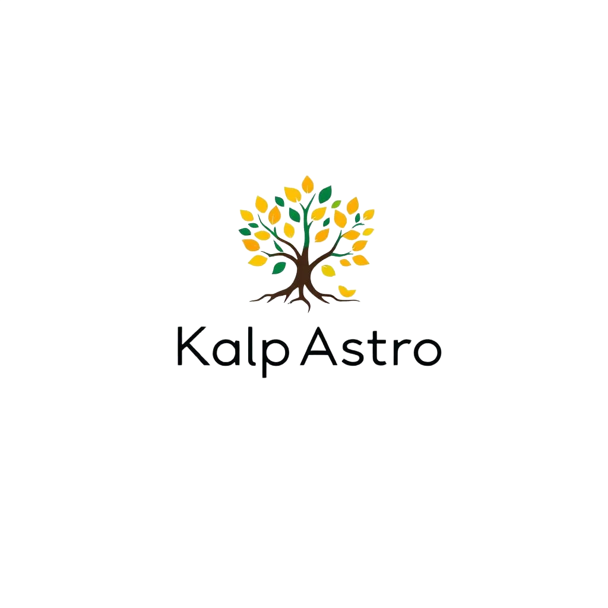

# AstroChatak Landing Page

Beautiful, modern landing page inspired by Melooha's design.

## 🎨 Features

- **Hero Section** - Eye-catching gradient background with floating moon animation
- **What Is Section** - Three-card layout explaining the value proposition
- **Features Grid** - 6 feature cards showcasing app capabilities
- **How It Works** - 3-step process with numbered badges
- **Testimonials** - Social proof with ratings
- **CTA Section** - Call-to-action with gradient background
- **Footer** - Complete footer with links

## 🚀 Quick Start

### Option 1: Simple File Server (Easiest)

```bash
cd ~/Desktop/startup/astrology-os-mvp/landing-page
python3 -m http.server 8080
```

Open: http://localhost:8080

### Option 2: Live Server (VS Code)

1. Install "Live Server" extension in VS Code
2. Right-click `index.html` → "Open with Live Server"

### Option 3: Direct Open

Simply double-click `index.html` in Finder to open in browser.

---

## 📱 What's Included

### Sections:
1. **Navigation Bar** - Sticky header with links
2. **Hero** - Large headline with CTA button
3. **Value Proposition** - 3 cards (Cosmic Mechanics, Hidden Potential, Extraordinary Life)
4. **Features** - 6 feature cards
5. **How It Works** - 3-step guide
6. **Testimonials** - 3 user reviews with ratings
7. **CTA** - Final call-to-action
8. **Footer** - Links and copyright

### Design Elements:
- ✅ Purple/indigo gradient theme
- ✅ Smooth animations (hover effects, floating elements)
- ✅ Fully responsive (mobile, tablet, desktop)
- ✅ Modern glassmorphism style
- ✅ Clean typography (Inter font)
- ✅ Tailwind CSS (CDN - no build needed)

---

## 🎯 Customization

### Change Colors

In the `<script>` section at the top:

```javascript
tailwind.config = {
    theme: {
        extend: {
            colors: {
                primary: '#6366f1',  // Change this
                secondary: '#8b5cf6', // Change this
            }
        }
    }
}
```

### Update Content

All text is in plain HTML. Simply find and replace:

- **Company Name:** Search for "AstroChatak"
- **Tagline:** Search for "Your Personal AI Astrologer"
- **Testimonials:** Replace names and quotes in testimonial section

### Add Your Logo

Replace the emoji (✨) with an `` tag:

```html

```

### Link to Your App

Change the "Launch App" button URL:

```html
<a href="YOUR_APP_URL">Launch App</a>
```

Currently points to: `http://localhost:5173` (your dev server)

---

## 📊 Performance

- **Load Time:** <1 second (single HTML file)
- **No Build Required:** Uses Tailwind CDN
- **No Dependencies:** Zero npm packages
- **SEO Ready:** Semantic HTML, meta tags included
- **Mobile Optimized:** Responsive breakpoints

---

## 🌐 Deploy to Production

### Option 1: Netlify (Free)

1. Go to: https://app.netlify.com/drop
2. Drag the `landing-page` folder
3. Done! You'll get a URL like: `your-site.netlify.app`

### Option 2: Vercel (Free)

```bash
npm install -g vercel
cd ~/Desktop/startup/astrology-os-mvp/landing-page
vercel
```

### Option 3: GitHub Pages (Free)

1. Create GitHub repo
2. Push `landing-page` folder
3. Enable GitHub Pages in Settings
4. Access at: `username.github.io/repo-name`

---

## 🎨 Design Inspiration

Inspired by:
- Melooha.com (structure and flow)
- Modern SaaS landing pages
- Gradient aesthetics
- Vedic/spiritual themes

---

## ✅ Checklist Before Launch

- [ ] Update "Launch App" button with real app URL
- [ ] Replace placeholder testimonials with real ones
- [ ] Add real logo (replace ✨ emoji)
- [ ] Update footer links
- [ ] Add Google Analytics (optional)
- [ ] Test on mobile devices
- [ ] Add custom domain (optional)
- [ ] Set up contact form (optional)

---

## 📝 Next Steps

1. **Get Feedback** - Share with 5-10 people
2. **A/B Test Headlines** - Try different hooks
3. **Add Waitlist** - Collect emails before launch
4. **SEO Optimization** - Add meta descriptions, Open Graph tags
5. **Performance** - Optimize images if you add any

---

*Built with ❤️ for AstroChatak*  
*Ready to deploy in minutes!*
